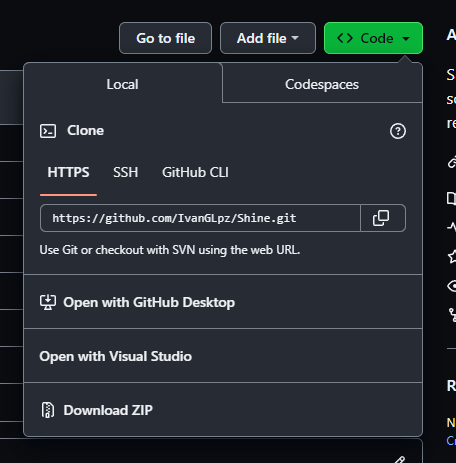
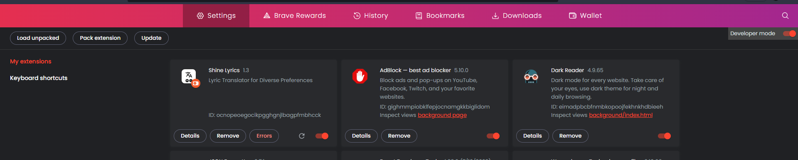
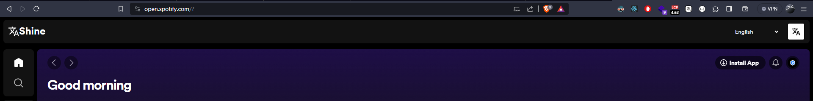

# Shine Lyrics - Browser Extension

Shine lyrics is a script created to translate songs from spotify and You tube music in real time using javascript.

NOTE: This code and repository are open source so any legal action attempted will be void. The owner Milton Garcia is hereby released from any and all charges or lawsuits.

## Installation

1. Download the repository using the git tool or download the code.

   

   ```
   git clone https://github.com/IvanGLpz/Shine
   ```

2. You must go to your browser extensions section and activate the developer mode and load the downloaded package.

   

3. To load the package you only have to select the folder where it is located
4. Check the spotify.com or youtubemusic page to make sure the extension works.

   

### Extra

Both spotify and you tube music can install the application. You can continue to use the extension without any problem


### How it works

Shine Lyrics has full access to the browser using good programming practices and following all the rules established by google justifying why and how the extension was made this way.

Shine DOES NOT COLLECT CONFIDENTIAL INFORMATION, AND DOES NOT COLLECT TRANSLATIONS OF SONGS. EVERYTHING IS COMPLIANT WITH THE LAW AND IN AN OPEN SOURCE WAY THE DEVELOPER OR USER HAS ALL THE RESPONSIBILITY OF USE. MILTON HAS NO AFFILIATION WITH THE USER OR DEVELOPER AND IS NOT RESPONSIBLE FOR THE USE OF SHINE LYRICS - OPEN SOURCE.

Shine only extracts from the HTML of the current page the songs and translates the songs into different languages. Using Javascript Shine creates the visual elements and UI interaction.
